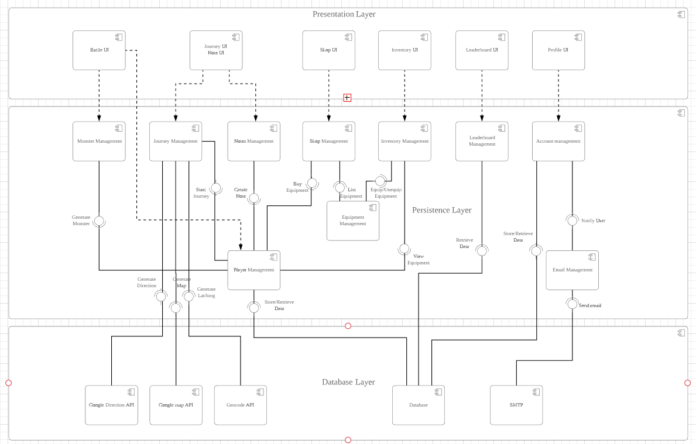

# ICT2X01 Team 13 - Project W.A.L.K.

## Introduction

The main idea of our project is to encourage and instill walking to members of the public as their main part of daily commuting in Singapore through engagement in our gamification routing application. The name of the product that we are developing is “Wandering Around Lost Kingdom” (W.A.L.K.). The game application requires the user to register to create their own character and set their home and work or school locations. The application will generate random journey paths of the First Mile and Last Mile (FMLM) for the user to explore for equipment. The equipment can be equipped to the user’s character to assist them to fight better during the battle. Additionally, our application is able to monitor the number of steps taken, the distance of their journey route and view character’s level and exp. The more the user walk, the more damage will be done to the mobs. The application will have a Leaderboard displaying the Overall and Top 5 players for the Most Damage and Highest Number of Steps. Finally, the user is able to engage with other players in the application by pinning notes at any point of their journey route using the geotag to let other players view the notes. They are also able to report any notes that are deemed inappropriate or feedback on their journey route.

The purpose of this file is to introduce the final Component Diagram, User Stey-by-step Guide on running this prototype app, a YouTube video url showcasing the prototype app and a Google Form url for Feedback form.

## Final Component Diagram

## Step-by-step Guide
- Run from Expo iOS/Android devices
1. Install Expo application on your iOS/Android device from Appstore or Playstore (Application development tool)
2. Clone the master branch from GitHub 
3. Install all depenencies at the root directory with npm install command
4. Run the application on the root directory with expo start or npm start command
5. Scan the QR Code from your phone that appeared while running the application
(make sure the connections on your PC and Phones are on the same network)
6. The application will be able to run on your phone. 

- Run from Android devices
1. Download the APK file from the link below with your Android device. (APK Download)
2. Install the downloaded file
3. The application will be found in your App drawer on your phone.

## Feedback Form

Google Feedback Form for users:
https://forms.gle/fYVAJ1uXhA72Xgfg9

## APK Download
https://drive.google.com/drive/folders/1qkQnjpS14Zlw5tMcbK58M9-4H5QpBvUD?usp=sharing
